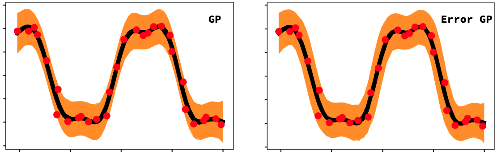

# Input Uncertainty for Gaussian Processes

* Author: J. Emmanuel Johnson
* Email: jemanjohnson34@gmail.com
* Documentation: [jejjohnson.github.io/uncertain_gps](https://jejjohnson.github.io/uncertain_gps)
* Repo: [github.com/jejjohnson/uncertain_gps](https://github.com/jejjohnson/uncertain_gps)

---

A graphical model of a GP algorithm with the addition of uncertainty component for the input.

This repository is home to my studies on uncertain inputs for Gaussian processes. Gaussian processes are a kernel Bayesian framework that is known to generalize well for small datasets and also offers predictive mean and predictive variance estimates. It is one of the most complete models that model uncertainty.

Demo showing the error bars for a standard GP predictive variance and an augmented predictive variance estimate using Taylor expansions.

In this repository, I am interested in exploring the capabilities and limits with Gaussian process regression algorithms when handling noisy inputs. Input uncertainty is often not talked about in the machine learning literature, so I will be exploring this in great detail for my thesis.

---

## Taylor Approximation

$$
\begin{aligned}
\mu_\text{eGP}(\mathbf{x_*}) &= k(\mathbf{x_*}) \, \mathbf{K}_{GP}^{-1}y=k(\mathbf{x_*}) \, \alpha  \\
\sigma_{eGP}^2(\mathbf{x_*}) &= \sigma_y^2 + k_{**}- {\bf k}_* ({\bf K}+\sigma_y^2 \mathbf{I}_N )^{-1} {\bf k}_{*}^{\top} + 
{\color{red}{\nabla_{\mu_{GP_*}}\Sigma_x\nabla_{\mu_{GP_*}}^\top} +
\text{Tr} \left\{  
  \frac{\partial^2 \sigma^2_{GP*}(\mathbf{x_*})}{\partial\mathbf{x_*}\partial\mathbf{x_*}^\top} \bigg\vert_{\mathbf{x_*}=\mu_{\mathbf{x_*}}} \Sigma_\mathbf{x_*}
\right\}}
\end{aligned}
$$

We can approximate the predictive mean and variance equations via a Taylor expansion which adds a corrective term w.r.t. the derivative of the function and the known variance. This assumes we know the variance and we don't modify the predictive mean of the learned GP function.

!!! details "1D Demo"

    === "Exact GP"

        

        

        

    === "1st Order Taylor"

        

        

        

        $$
        \nu_{eGP*}^2 =  
        \nu_{GP*}^2(\mathbf{x}_*)  +
        {\color{red}{\nabla_{\mu_*}\Sigma_x\nabla_{\mu_*}^\top}}
        $$

    === "2nd Order Taylor"

        

        

        

        $$
        \nu_{eGP*}^2 =  
        \nu_{GP*}^2(\mathbf{x}_*)  +
        {\color{red}{\nabla_{\mu_*}\Sigma_x\nabla_{\mu_*}^\top} +
        \text{Tr} \left\{  
          \frac{\partial^2 \nu^2_{GP*}(\mathbf{x_*})}{\partial\mathbf{x_*}\partial\mathbf{x_*}^\top} \bigg\vert_{\mathbf{x_*}=\mu_{\mathbf{x_*}}} \Sigma_\mathbf{x_*}
        \right\}}
        $$

    === "Differences"

        

        

        

        Here, we see a plot for the differences between the two GPs.

??? details "Satellite Data"

    === "Absolute Error"

        

    === "Exact GP"

        

        These are the predictions using the exact GP and the predictive variances.

    === "Linearized GP"

        

        This is an example where we used the Taylor expanded GP. In this example, we only did the first order approximation.

---

## Unscented Transforms

The predictive mean and variance using the Unscented transformation.

---

## Variational Inference

**TODO**

---

## Monte Carlo Estimation

!!! details "1D Example"

    === "Posterior Approximation"

        

    === "Training"

        === "Exact"

            

        === "Prior"

            

        === "Known Input Error"

            

---

## My Resources

#### [Literature Review](https://jejjohnson.github.io/uncertain_gps/#/literature)

I have gone through most of the relevant works related to noisy inputs in the context of Gaussian processes. It is very extensive and it also offers some literature that is relevant but may not explicitly mentioned uncertain inputs in the paper.

#### [Documentation](https://jejjohnson.github.io/uncertain_gps/)

I have some documentation which has all of my personal notes and derivations related to GPs and noisy inputs. Some highlights include the Taylor approximation, moment matching and variational inference.

#### [GP Model Zoo](https://jejjohnson.github.io/gp_model_zoo/#/literature)

I have documented and try to keep up with some of the latest Gaussian process literature in my repository.

